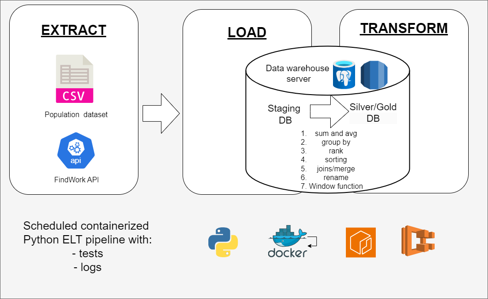
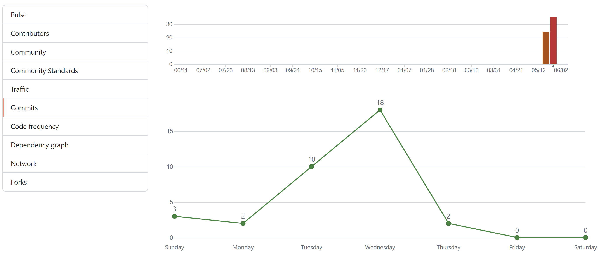
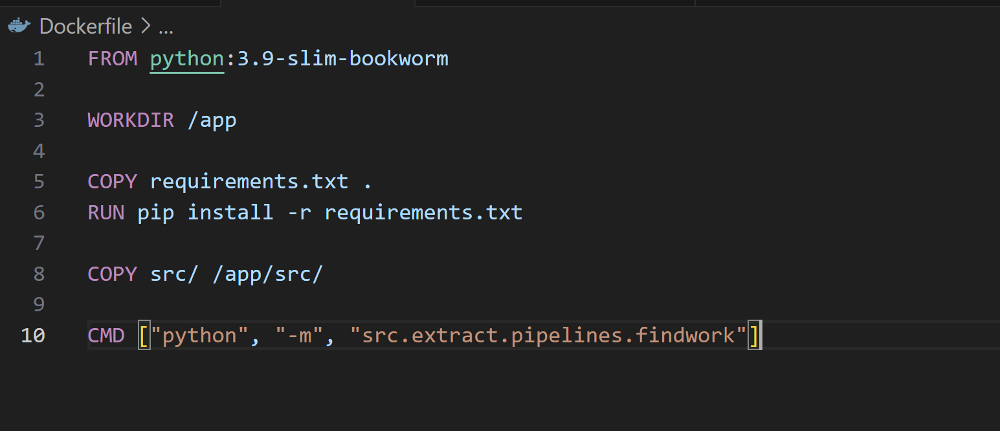
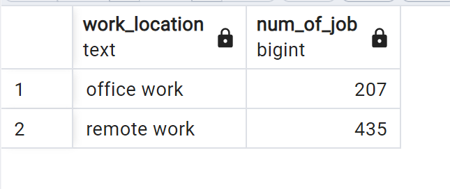
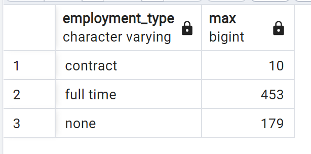
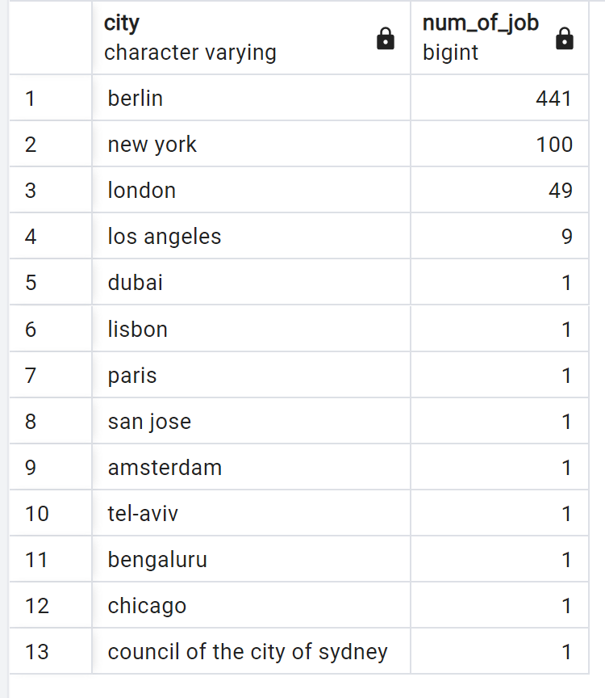

# Project 1 - ELT pipeline

Ben - [rockerben](https://github.com/rockerben)
Emily - [ZhiwenSong1](https://github.com/ZhiwenSong1)
Jessica - [JesSchattschneider](https://github.com/JesSchattschneider)

---
# Objective

Provide analytical datasets for new data engineers who want to know where to look for jobs and which cities have the potential of being less competitive based on their population size.

---

# Questions

- Are there remote job opportunities available?
- What are the most common employment types?
- What is the population of the top 10 cities with more job opportunities? 

---

# Data sources

| Source name | Source type | Source documentation |
| - | - | - |
| Population data | csv | TBC |
| findwork API | REST API | [DOCS](https://findwork.dev/developers/#api-key) |

---

# Solution architecture

---
# GIT

- [GIT Repository](https://github.com/JesSchattschneider/project-1-bootcamp-group-1)

- Activity (9 branches, 17 pull requests and ~80 commits)

---

# Reverse geocoding

## Problem

Inconsistencies in how both datasets store their locations.

---

## Example API - location attribute

| Location                                          |
|----------------                                   |
|New York (NYC)                                     |
|Remote (Europe, US)              
|Berlin, Germany
|Canada
|Amsterdam, Berlin, Ghent (EU) On-site/hybrid
|Remote, US
|Hamburg, Germany (or remote EU) 
|UK|

---

## Example CSV - city and country

| City          | Country        |
| -------       | -------        |
| Tokyo         | Japan          |
| Shanghai      | China          |
| Dhaka         | Bangladesh     |
| Sao Paulo     | Brazil         |

---

## Solution

- Separate country and city from location attribute in the API response (transformation ste - python approach)
- Use geopy to the reverse geocoding
- Apply the same approach to the population dataset - groom the original dataset before using it in the pipeliene - 7 min process

---

# Extract [Ben]

- CSV
- API - talk about the incremental step and the db checking to identify the number of pages to be extracted []

---

# Load [Ben]

- Load the csv and API to a "bronze DB"

---

# Transform

- Use a python based transformation function to "clean" the location name and load the groomed dataset to the "findwork_data_transformed" table. All the jinja based transformations dependend on the "findwork_data_transformed" table.

- jinja [EMILY] 

---

# Docker

---

# Production [TBD]

AWS

---

# Results

- Are there remote job opportunities available?

- What are the most common employment types?

---

-  What is the population of the top 10 cities with more job opportunities **(SQL needs review)**?

